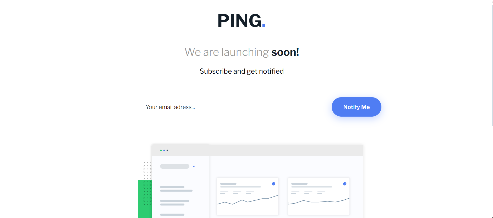
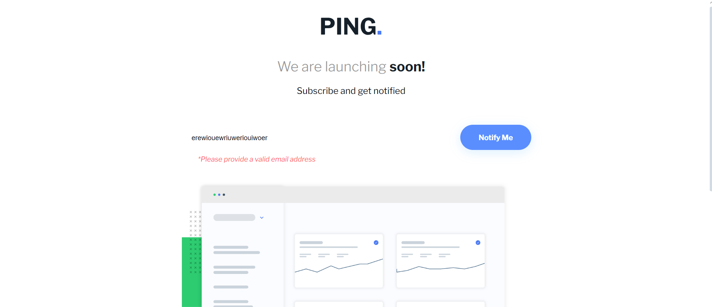

# Frontend Mentor - Ping coming soon page solution

This is a solution to the [Ping coming soon page challenge on Frontend Mentor](https://www.frontendmentor.io/challenges/ping-single-column-coming-soon-page-5cadd051fec04111f7b848da). Frontend Mentor challenges help you improve your coding skills by building realistic projects. 

## Table of contents

- [Overview](#overview)
  - [The challenge](#the-challenge)
  - [Screenshot](#screenshot)
  - [Links](#links)
- [My process](#my-process)
  - [Built with](#built-with)
  - [What I learned](#what-i-learned)
  - [Continued development](#continued-development)
  - [Useful resources](#useful-resources)
- [Author](#author)
- [Acknowledgments](#acknowledgments)

**Note: Delete this note and update the table of contents based on what sections you keep.**

## Overview

### The challenge

Users should be able to:

- View the optimal layout for the site depending on their device's screen size
- See hover states for all interactive elements on the page
- Submit their email address using an `input` field
- Receive an error message when the `form` is submitted if:
	- The `input` field is empty. The message for this error should say *"Whoops! It looks like you forgot to add your email"*
	- The email address is not formatted correctly (i.e. a correct email address should have this structure: `name@host.tld`). The message for this error should say *"Please provide a valid email address"*

### Screenshot

![])   

### Links

- Solution URL: [Add solution URL here](https://github.com/ysmltr/ping-coming-soon-page-master.git)
- Live Site URL: [Add live site URL here](https://pingcomingsoon.netlify.app)

## My process

### Built with

- Semantic HTML5 markup
- CSS custom properties
- Flexbox
- CSS Grid
- Mobile-first workflow

## Author

- Website - (https://pingcomingsoon.netlify.app)
- Frontend Mentor - [@yourusername](https://www.frontendmentor.io/profile/ysmltr)
- Twitter - [@yesimltr](https://twitter.com/yesimltr)

**Note: Delete this note and add/remove/edit lines above based on what links you'd like to share.**

## Acknowledgments

I got some help from: 
https://github.com/lere22/ping-single-column-coming-soon-page  
https://github.com/Samolote/ping-single-column-coming-soon-page-frontendmentor